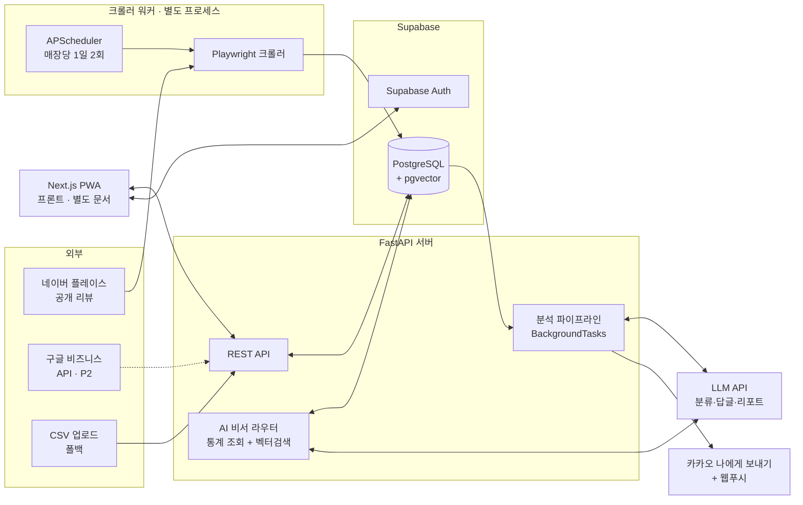

# 리뷰 진단 AI SaaS — 기술 구현 명세서 (백엔드·AI·데이터·인프라)

> WE-Meet 창업 유형 · 3인 팀(SW 2, AI 1) · 12주 기준
> 범위: **프론트엔드 제외** 전 영역. 프론트(Next.js PWA)는 본 문서의 REST API를 소비하는 클라이언트로만 언급한다.
> 최종 수정: 2026-07-16

---

## 0. 이번 검토에서 수정한 것 (변경 로그)

기존 대화에서 잡았던 구조를 실구현 기준으로 재검증했고, 아래 4곳을 수정했다. 나머지는 그대로 유지.

| # | 기존 | 수정 | 이유 |
|---|---|---|---|
| 1 | AI 비서 = "RAG(pgvector) 기반" | **하이브리드: 사전집계 통계 조회 + 벡터검색 근거 인용** | "이번 달 제일 큰 문제 뭐야?" 같은 질문의 답은 **집계(통계)**이지 유사문서 검색이 아님. 순수 RAG로 만들면 "대기시간 32% 증가" 같은 수치를 못 냄. 라우터로 질문 유형을 나눠 통계 테이블과 벡터검색을 조합해야 정확한 답이 나온다 |
| 2 | DB = "PostgreSQL + pgvector" (자체 운영 암시) | **Supabase (관리형 Postgres + pgvector + Auth 내장)** | 학생 팀이 DB 서버 운영·백업·Auth 구현에 시간을 쓰면 안 됨. Supabase 무료 티어로 셋 다 해결. 로컬 개발은 Docker postgres로 동일 스키마 |
| 3 | 비동기 처리 방식 미정 (Celery 등 여지) | **APScheduler + FastAPI BackgroundTasks로 확정, 메시지큐 금지** | 매장 10곳 미만·하루 수백 건 처리에 Celery+Redis는 오버엔지니어링. 파일럿 규모에선 스케줄러 하나로 충분하고, 장애 지점만 늘어남 |
| 4 | 네이버 답글 "승인형 게시" (방식 모호) | **반자동으로 확정: 승인 → 클립보드 복사 + 스마트플레이스 답글창 딥링크 열기.** 계정위임 자동 게시는 구현하지 않고 사업화 로드맵으로만 | 네이버는 답글 API가 없어 자동 게시는 사장님 계정 위임(비공식 로그인 자동화)이 필요 — 법적 회색지대 + 계정 잠금 리스크를 MVP가 질 이유가 없음. 반자동도 UX상 "10초 컷"이라 데모 가치 동일 |

유지 확정된 것: 네이버 중심 수집(Playwright), 구글 API는 P2 보너스(승인 게이트 때문), 알림은 카카오 "나에게 보내기" + 웹푸시(알림톡은 사업자등록 필요로 제외), LLM 분류 → KoELECTRA 증류 로드맵, P0/P1/P2 범위.

---

## 1. 시스템 개요

**한 줄 정의**: 네이버 플레이스(+구글) 리뷰를 자동 수집·분석해 ① 부정리뷰 즉시 알림 ② AI 답글 초안(승인형) ③ 진단·처방 리포트 ④ 경쟁매장 비교 ⑤ 자연어 질의 비서를 제공하는 소상공인 B2B SaaS.



**설계 원칙 3개**
1. **모놀리스 + 워커 1개.** 서비스는 FastAPI 단일 앱, 크롤러만 별도 프로세스. MSA·메시지큐·캐시서버 금지 — 파일럿 규모에서 복잡도는 순손실.
2. **모든 AI 출력은 구조화(JSON).** LLM 호출은 전부 JSON 스키마 강제 + 파싱 실패 시 1회 재시도. 프롬프트는 코드가 아닌 `prompts/` 디렉토리에 버전 관리.
3. **데모 이중화.** 모든 화면은 "사전 수집된 캐시 데이터"만으로 완전 동작해야 함. 라이브 크롤링은 데모의 클라이맥스이지 전제가 아님.

---

## 2. 기술 스택 확정

| 영역 | 선택 | 선정 이유 (대안 대비) |
|---|---|---|
| API 서버 | **Python 3.12 + FastAPI** | AI 파이프라인과 같은 언어로 통일(팀 3명이 컨텍스트 스위칭 최소화). async 지원, 자동 OpenAPI 문서 |
| 크롤러 | **Playwright (Python, headless Chromium)** | Selenium 대비 안정적 대기(auto-wait)·셀렉터 API 우수. 네이버 플레이스는 JS 렌더링이라 requests 불가 |
| 스케줄러 | **APScheduler** (크롤러 워커 내장) | cron 문법, 파이썬 네이티브. Celery/Airflow는 규모 대비 과함 |
| DB | **Supabase** (PostgreSQL 15 + pgvector) | 관리형이라 운영 부담 0. pgvector로 벡터DB 별도 구축 불필요. 무료 티어 500MB로 파일럿 충분 |
| 인증 | **Supabase Auth** (JWT) | 소셜로그인(카카오) 내장. FastAPI에서 JWT 검증만 하면 됨 — 직접 구현 금지 |
| LLM | **LLM API** (Claude 계열 기본, 프로바이더 추상화 레이어 필수) | 분류·답글·리포트·비서 전부. 벤더 교체 가능하도록 `llm/client.py` 한 곳에서만 호출 |
| 임베딩 | **BGE-M3** (로컬, CPU 가능) 또는 API 임베딩 | 한국어 성능 검증됨. 리뷰가 짧아 CPU 추론으로 충분 → 비용 0원 |
| 분류 모델(2단계) | **KoELECTRA-small 파인튜닝** (Colab 무료 T4) | LLM 라벨 2~3천 건 축적 후 증류. 추론 비용 제거 + "비용 1/100" 발표 포인트 |
| 알림 | **카카오 톡메시지 "나에게 보내기" API + 웹푸시(VAPID)** | 알림톡은 사업자등록 필요로 MVP 불가. 나에게 보내기는 개인 개발자 앱 + 사용자 동의(talk_message)로 가능 |
| 배포 | **VM 1대 (AWS Lightsail/EC2 t3.small) + Docker Compose** | API + 크롤러 워커 2컨테이너. Playwright가 Chromium을 띄우므로 서버리스 부적합 |
| CI | GitHub Actions (테스트 + 도커 빌드) | 푸시 → 자동 배포까지는 선택 |

**월 비용 추정**: VM ~1.5만 원 + LLM API 1~3만 원 + Supabase 0원 + 도메인 ≈ **월 3~5만 원**.

---

## 3. 수집 레이어 (크롤러 워커)

### 3.1 대상과 방식
- **네이버 플레이스 (P0)**: 모바일 웹 리뷰 페이지가 데스크톱보다 구조가 단순해 크롤링 표적으로 삼는다. Playwright로 접속 → "더보기" 페이지네이션 반복 → 리뷰 블록 파싱(작성자 표시명, 별점, 본문, 방문일, 방문차수).
- **구글 (P2)**: Business Profile API `reviews.list`. 1주차에 파일럿 매장 사장님 명의로 액세스 신청만 넣어두고, 승인 시 어댑터 추가. 코드상 `collectors/base.py` 인터페이스를 두고 네이버/구글/CSV가 같은 인터페이스를 구현한다.
- **CSV 업로드 (P0, 폴백)**: 크롤러 전면 장애 시에도 서비스가 동작함을 보장. `작성일,별점,본문` 3컬럼 최소 스키마.

### 3.2 스케줄·차단 회피 정책
- 매장당 **1일 2회** (오전 9시 / 오후 9시 ± 랜덤 지터 0~30분). 파일럿 10곳 기준 하루 20세션 — 차단 가능성 낮은 볼륨.
- 브라우저 인스턴스 1개로 **순차 처리** (병렬 금지 — 속도보다 안정).
- 증분 수집: 최신순으로 읽다가 이미 저장된 리뷰(중복 키)를 2페이지 연속 만나면 중단.
- 중복 키: `hash(작성자표시명 + 방문일 + 본문 앞 50자)` — 네이버는 리뷰 고유 ID가 DOM에 안정적으로 노출되지 않는다고 가정하고 설계.

### 3.3 셀렉터 깨짐 대응 (최대 리스크)
- CSS 셀렉터를 코드에 하드코딩하지 않고 **`selectors.yaml`로 외부화**. 네이버 개편 시 YAML만 수정해 재배포 없이 복구.
- **자가 진단**: 수집 결과 0건이 2회 연속이면 "구조 변경 의심" 관리자 알림(카카오) 자동 발송.
- 실패 시 지수 백오프 재시도(5분 → 30분 → 2시간), 3회 실패 시 해당 세션 포기 후 다음 스케줄 대기.
- 원본 HTML 스냅샷을 7일 보관(디버깅용).

### 3.4 수집 정책 (발표 방어 논리 포함)
- MVP 수집 대상은 **① 동의받은 파일럿 매장 ② 경쟁 비교용 인근 매장의 공개 리뷰 최소량**으로 한정.
- 로그인 없이 접근 가능한 공개 데이터만, 저빈도로 수집. robots·이용약관 이슈는 인지하고 있으며, **사업화 단계에서는 사장님 계정 위임(본인 데이터 접근) + 플랫폼 제휴로 전환**하는 로드맵을 명세에 포함 — 심사 질문("크롤링 불법 아니냐")에 대한 표준 답변.
- 리뷰 작성자 표시명은 저장 시 마스킹(`김**`), 원문 표시명은 저장하지 않는다.

---

## 4. 데이터 레이어 (Supabase / PostgreSQL)

### 4.1 핵심 스키마 (DDL 초안)

```sql
-- 사용자·매장
create table stores (
  id            bigint generated always as identity primary key,
  owner_id      uuid not null references auth.users(id),  -- Supabase Auth
  name          text not null,
  category      text,                    -- 카페/식당/미용실
  address       text,
  created_at    timestamptz default now()
);

create table store_channels (              -- 매장 1 : N 채널(플랫폼)
  id            bigint generated always as identity primary key,
  store_id      bigint not null references stores(id),
  platform      text not null check (platform in ('naver','google','csv')),
  external_url  text,                     -- 네이버 플레이스 URL 등
  is_competitor boolean default false,    -- 경쟁매장 채널도 동일 테이블
  competitor_of bigint references stores(id)
);

-- 리뷰 원본
create table reviews (
  id            bigint generated always as identity primary key,
  channel_id    bigint not null references store_channels(id),
  dedup_key     text not null,
  author_masked text,
  rating        smallint,                 -- 1~5, 네이버 미제공 시 null
  body          text not null,
  written_at    date,
  collected_at  timestamptz default now(),
  unique (channel_id, dedup_key)
);

-- AI 분석 결과 (리뷰 1:1)
create table review_analysis (
  review_id     bigint primary key references reviews(id),
  sentiment     text check (sentiment in ('pos','neu','neg')),
  severity      text check (severity in ('normal','uncomfortable','complaint','malicious')),
  urgent        boolean default false,    -- 위생/이물/환불/법적 언급
  aspects       jsonb not null,           -- [{"category":"대기시간","polarity":"neg"},...]
  keywords      text[],
  model_ver     text,                     -- 'llm-v1' | 'koelectra-v1' (증류 전환 추적)
  analyzed_at   timestamptz default now()
);

-- 임베딩 (비서 근거검색용)
create table review_embeddings (
  review_id     bigint primary key references reviews(id),
  embedding     vector(1024)              -- BGE-M3 기준
);
create index on review_embeddings using hnsw (embedding vector_cosine_ops);

-- 답글
create table replies (
  id            bigint generated always as identity primary key,
  review_id     bigint not null references reviews(id),
  tone          text,                     -- 정중/친근/사과
  draft         text not null,
  status        text default 'draft' check (status in ('draft','approved','discarded')),
  approved_at   timestamptz
);

-- 주간 사전집계 (비서·대시보드·리포트의 단일 소스)
create table weekly_aspect_stats (
  store_id      bigint references stores(id),
  week_start    date,
  aspect        text,                     -- 맛/친절/청결/대기시간/가격/분위기
  pos_cnt int, neg_cnt int, total_cnt int,
  avg_rating    numeric(3,2),
  primary key (store_id, week_start, aspect)
);

-- 진단 리포트 (주 1회 생성)
create table reports (
  id            bigint generated always as identity primary key,
  store_id      bigint references stores(id),
  week_start    date,
  diagnosis     jsonb,                    -- [{level:'crit',title,evidence,..}]
  prescriptions jsonb,                    -- [{title,detail,expected_effect}]
  created_at    timestamptz default now()
);

-- 알림 로그, 비서 대화
create table alerts (
  id bigint generated always as identity primary key,
  store_id bigint, review_id bigint, kind text,  -- urgent_review/trend/system
  sent_via text[], created_at timestamptz default now()
);
create table chat_messages (
  id bigint generated always as identity primary key,
  store_id bigint, role text check (role in ('user','assistant')),
  content text, created_at timestamptz default now()
);
```

### 4.2 설계 노트
- **경쟁매장도 `store_channels`로 통일** (`is_competitor=true`) — 수집·분석 파이프라인을 그대로 재사용하기 위함. 경쟁매장은 분석까지만 하고 답글·알림은 생성하지 않는다.
- **`weekly_aspect_stats`가 심장.** 대시보드·리포트·AI 비서가 전부 이 테이블을 읽는다. 리뷰 분석이 끝날 때마다 해당 주 row를 upsert (실시간 재계산 금지 — 읽기 쿼리를 단순하게).
- 마이그레이션은 Supabase CLI + SQL 파일로 버전 관리.

---

## 5. AI 파이프라인

### 5.1 리뷰 분석 (P0)

```
신규 리뷰 (수집 완료 트리거)
  → 10~20건 배치로 LLM 호출 (JSON 스키마 강제)
     출력: sentiment / severity / urgent / aspects[] / keywords[]
  → review_analysis insert + weekly_aspect_stats upsert
  → urgent=true 또는 rating<=2 → 알림 파이프라인 즉시 발화
  → 임베딩 생성(BGE-M3) → review_embeddings insert
```

- 배치 처리로 호출 수 절감. 파싱 실패 시 1회 재시도, 재실패 시 `model_ver='failed'`로 마킹하고 스킵(파이프라인 전체를 멈추지 않는다).
- **2단계(증류, 8주차~)**: 축적된 LLM 라벨 2~3천 건으로 KoELECTRA-small을 sentiment/aspect 멀티라벨 분류로 파인튜닝(Colab T4). 신뢰도 상위 케이스는 로컬 모델, 애매한 케이스(confidence < 0.8)만 LLM으로 — 비용·속도 개선을 수치로 만들어 발표에 사용. **AI전공 팀원의 핵심 딜리버러블.**

### 5.2 답글 생성 (P0)

- 입력: 리뷰 본문 + 분석 결과 + **사장님 톤 프로필**(온보딩 때 기존 답글 3~5개 수집 → few-shot) + 선택 톤(정중/친근/사과).
- 가드레일(프롬프트 명시): 보상·환불 **약속 금지**(안내만), 법적 책임 인정 표현 금지, 150자 내외, 고객 표현 그대로 인용 금지(악성 리뷰 재확산 방지).
- 게시 플로우(반자동 — 변경 로그 #4): `승인` 클릭 → `replies.status='approved'` → 프론트가 클립보드 복사 + 스마트플레이스 답글 페이지 새 창. **서버는 네이버에 어떤 자동 게시도 하지 않는다.**

### 5.3 주간 진단 리포트 (P1)

- 매주 월 07:00 배치: `weekly_aspect_stats` 4주치 + 급증 키워드 + 경쟁매장 통계를 프롬프트에 넣어 LLM이 `diagnosis[]`(위험/주의/강점/기회, 각 항목에 **근거 수치 필수**)와 `prescriptions[]`(실행 항목 + 예상 효과)를 생성.
- 환각 방지: 리포트의 모든 수치는 **프롬프트에 넣어준 집계값만 인용**하도록 강제하고, 생성 후 서버가 수치 존재 여부를 검증(집계에 없는 숫자가 나오면 재생성).

### 5.4 경쟁매장 비교 (P1)

- 온보딩 때 사장님이 경쟁매장 네이버 URL 2~3개 등록 → 동일 수집·분석 파이프라인 → aspect별 우리 vs 경쟁 통계 비교 + LLM 한 줄 인사이트("경쟁점 대기시간 우위는 사전주문 도입 영향으로 추정").

### 5.5 AI 사장님 비서 (P1) — 하이브리드 (변경 로그 #1)

```
질문 → LLM 라우터 (1회 호출, 질문 유형 + 파라미터 추출)
  ├─ 통계형 ("제일 큰 문제", "지난달 대비")
  │    → weekly_aspect_stats SQL 조회 (서버가 조립한 안전한 파라미터 쿼리만)
  ├─ 근거형 ("위생 관련 리뷰 보여줘")
  │    → pgvector 유사도 검색 (기간·감정 메타필터 병용)
  └─ 복합형 → 둘 다 실행
→ 조회 결과를 컨텍스트로 LLM 최종 답변 (수치 + 근거 리뷰 인용)
→ 데이터가 비면 "해당 기간 데이터가 부족해요"로 정직하게 응답 (환각 금지)
```

- **자유 Text-to-SQL은 금지.** 라우터는 미리 정의된 쿼리 템플릿 중 선택 + 파라미터만 채운다(SQL 인젝션·환각 쿼리 차단).

---

## 6. 알림 파이프라인 (P0)

| 채널 | 용도 | 제약 |
|---|---|---|
| 카카오 "나에게 보내기" | 긴급 리뷰 즉시 알림 | 개인 개발자 앱 가능. 온보딩 때 카카오 로그인 + `talk_message` 동의 필요 |
| 웹푸시 (VAPID, PWA) | 일반 알림·미답변 리마인드 | iOS는 홈 화면 추가(PWA 설치) 시에만 동작 — 온보딩에서 설치 유도 |
| (로드맵) 알림톡 | 사업화 단계 | 사업자등록 + 발신프로필 필요, MVP 제외 |

발송 규칙: `urgent` → 즉시 / 일반 부정 → 1시간 묶음 발송(스팸화 방지) / 주간 리포트 완성 → 월요일 오전 1회. 모든 발송은 `alerts`에 로깅.

---

## 7. API 설계 (FastAPI, `/api/v1`)

| 메서드·경로 | 기능 | 우선순위 |
|---|---|---|
| `POST /stores` / `GET /stores/{id}` | 매장 등록·조회 | P0 |
| `POST /stores/{id}/channels` | 네이버 URL 연결 (등록 직후 첫 수집 트리거) | P0 |
| `GET /stores/{id}/reviews?sentiment=&urgent=&answered=` | 리뷰 인박스 (커서 페이지네이션) | P0 |
| `POST /reviews/{id}/reply:generate` `{tone}` | AI 답글 초안 생성 | P0 |
| `POST /replies/{id}:approve` | 답글 승인 (반자동 게시 플로우) | P0 |
| `POST /stores/{id}/reviews:import` | CSV 업로드 폴백 | P0 |
| `GET /stores/{id}/dashboard?range=4w` | 점수·추세·aspect 통계 (weekly_aspect_stats 기반) | P1 |
| `GET /stores/{id}/reports/latest` | 주간 진단 리포트 | P1 |
| `GET /stores/{id}/compare` | 경쟁매장 비교 | P1 |
| `POST /stores/{id}/assistant/messages` | AI 비서 질의 (SSE 스트리밍 응답) | P1 |
| `POST /internal/crawl:trigger` (내부 인증) | 수동 수집 트리거 (데모용) | P0 |

- 인증: 모든 엔드포인트는 Supabase JWT 검증 미들웨어 통과. `store.owner_id == token.sub` 검사(다른 매장 데이터 접근 차단).
- 종합 평판 점수 산식(대시보드): `100 × (0.5·긍정비율 + 0.3·평점정규화 + 0.2·답변율)` — 단순·설명가능한 산식으로 시작하고, 가중치는 상수로 분리.

---

## 8. 배포·운영

```
[VM 1대: Lightsail 2GB]
  ├─ docker: api        (FastAPI + uvicorn)
  ├─ docker: worker     (APScheduler + Playwright + Chromium)
  └─ Caddy (HTTPS 리버스프록시, 자동 인증서)
[Supabase 클라우드]  DB + Auth
[Vercel]             프론트 (본 문서 범위 외)
[Colab]              KoELECTRA 파인튜닝 (일회성, GPU 불필요 상태로 서빙)
```

- 시크릿은 `.env` + VM 환경변수로만 (레포 커밋 금지). LLM 키·카카오 키·Supabase 서비스 키.
- 로깅: 구조화 JSON 로그 → 파일. 크롤러는 세션별 수집 건수/소요시간 기록 — "지난 8주 수집 성공률 99%" 같은 운영 수치를 발표 자료로 재활용.
- 백업: Supabase 자동 백업(무료 티어 7일) + 주 1회 `pg_dump`를 팀 드라이브에.

---

## 9. 리스크 매트릭스

| 리스크 | 확률 | 영향 | 대응 |
|---|---|---|---|
| 네이버 DOM 개편으로 크롤러 중단 | 중 | 상 | 셀렉터 YAML 외부화 + 0건 자가진단 알림 + HTML 스냅샷으로 반나절 내 복구. 최후: CSV 폴백 |
| 크롤링 차단(IP/캡차) | 저~중 | 중 | 저빈도·순차·지터로 예방. 발생 시 수집 주기 하향 + 파일럿 매장 사장님 수동 export 병행 |
| 구글 API 승인 거절/지연 | 중 | 저 | 이미 P2로 강등. 데모는 네이버만으로 완결 |
| LLM 환각(없는 수치 생성) | 중 | 중 | 리포트·비서 모두 "집계값만 인용" 강제 + 서버측 수치 검증 + 근거 리뷰 링크 |
| 심사 당일 라이브 실패 | 저 | 상 | 캐시 데이터로 전 화면 동작 보장(설계 원칙 3). 라이브 크롤링은 성공 시 보너스 |
| 파일럿 매장 미확보 | 중 | 상 | 기술 아님 — 1~2주차 최우선 과제로 지정, "무료 리뷰 분석 리포트" 제안으로 섭외 |

---

## 10. 역할 분담 · 12주 일정

| 주차 | SW A (크롤러·백엔드) | AI 전공 (파이프라인) | SW B (프론트·연동) |
|---|---|---|---|
| 1–2 | 크롤러 프로토타입, Supabase 스키마, 구글 API 신청 | LLM 분류 프롬프트 v1 + 평가셋 100건 수작업 라벨 | 프로젝트 셋업 · **팀 전원: 파일럿 매장 2~3곳 섭외** |
| 3–5 | 수집 스케줄러·증분수집·자가진단, 리뷰/분석 API | 분류 파이프라인 연결, 임베딩 저장, 정확도 측정 | 인박스·대시보드 화면 |
| 6–8 | 알림(카카오·웹푸시), 답글 API, 배포 | 답글 생성 + 톤 프로필, 주간 리포트 생성기 | 답글 승인 UX, 리포트 화면, PWA |
| 9–10 | 경쟁매장 수집 확장, 비교 API | AI 비서(라우터+하이브리드), KoELECTRA 증류 실험 | 비교·비서 화면 |
| 11–12 | 운영 안정화, 데모 캐시 준비 | 성능 수치 정리(정확도·비용절감) | 파일럿 지표 수집(Before/After), 발표 리허설 |

**범위 동결**: P0(수집·분석·알림·답글) + P1(대시보드·리포트·비교·비서) = 8개 기능에서 멈춘다. P2(매출예측·이탈예측·티켓팅·SNS통합·구글연동)는 발표 로드맵 슬라이드 전용 — 코드 한 줄도 쓰지 않는다.
